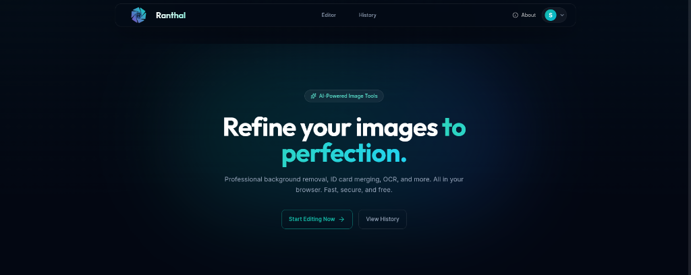
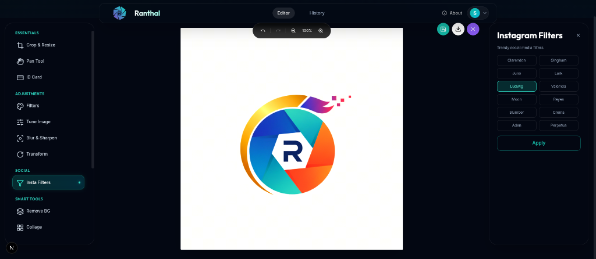

# Ranthal - Professional Image Editor

**Refine your images to perfection.**

Ranthal is a powerful, AI-powered web-based image editor designed for speed and privacy. It runs entirely in your browser, offering professional-grade tools without uploading your photos to a third-party server (except for specific AI tasks processed securely).



## Features

- **AI-Powered Tools**: Intelligent background removal and image enhancements.
- **Smart Adjustments**: Tune brightness, contrast, saturation, and more with precision.
- **Filters & Effects**: Apply trendy Instagram-style filters (Clarendon, Gingham, Ludwig, etc.) instantly.
- **ID Card Maker**: Create professional ID card layouts and A4 print-ready sheets easily.
- **Collage Maker**: Create collages layouts and A4 print-ready easily.
- **Privacy First**: Fast and secure processing.
- **Large Image Support**: Uses IndexedDB for local storage, supporting high-resolution edits without quota limits.
- **Mobile Friendly**: Full touch support for drawing and responsive tools (including specialized mobile toolbars).
- **Admin Controls**: Secure user management with self-deletion protection and auto-approval visibility.



## Getting Started

This application is built for production deployment using Docker.

### Prerequisites

- Docker
- Docker Compose (optional, for easier management)

## Deployment with Docker

The application is containerized and available on Docker Hub.

### Method 1: Docker Run

```bash
docker run -p 3000:3000 \
  -v $(pwd)/sqlite.db:/app/sqlite.db \
  -v $(pwd)/public/uploads:/app/public/uploads \
  safiyu/ranthal:latest
```

### Method 2: Docker Compose

1. Ensure you have the `docker-compose.yml` file:
   ```yaml
   version: '3.8'

   services:
     app:
       image: safiyu/ranthal:latest
       ports:
         - "3000:3000"
       environment:
         - NODE_ENV=production
         - DB_PATH=/app/db/sqlite.db
         - AUTH_TRUST_HOST=true
         - PUID=1000 # Customize your User ID
         - PGID=1000 # Customize your Group ID
         # URL Configuration (Available in v0.2.0+)
         - AUTH_URL=https://yourdomain.com # Required for correct sign-out redirect
         - NEXT_PUBLIC_APP_URL=https://yourdomain.com
       volumes:
         - ./db:/app/db
         - ./public/uploads:/app/public/uploads
       restart: unless-stopped
   ```

2. Run the application:
   ```bash
   docker-compose up -d
   ```

Check out our [Next.js deployment documentation](https://nextjs.org/docs/app/building-your-application/deploying) for more details.

## License

This project is licensed under the MIT License - see the [LICENSE](LICENSE) file for details.

```text
MIT License

Copyright (c) 2025 Ranthal

Permission is hereby granted, free of charge, to any person obtaining a copy
of this software and associated documentation files (the "Software"), to deal
in the Software without restriction, including without limitation the rights
to use, copy, modify, merge, publish, distribute, sublicense, and/or sell
copies of the Software, and to permit persons to whom the Software is
furnished to do so, subject to the following conditions:

The above copyright notice and this permission notice shall be included in all
copies or substantial portions of the Software.

THE SOFTWARE IS PROVIDED "AS IS", WITHOUT WARRANTY OF ANY KIND, EXPRESS OR
IMPLIED, INCLUDING BUT NOT LIMITED TO THE WARRANTIES OF MERCHANTABILITY,
FITNESS FOR A PARTICULAR PURPOSE AND NONINFRINGEMENT. IN NO EVENT SHALL THE
AUTHORS OR COPYRIGHT HOLDERS BE LIABLE FOR ANY CLAIM, DAMAGES OR OTHER
LIABILITY, WHETHER IN AN ACTION OF CONTRACT, TORT OR OTHERWISE, ARISING FROM,
OUT OF OR IN CONNECTION WITH THE SOFTWARE OR THE USE OR OTHER DEALINGS IN THE
SOFTWARE.
```
